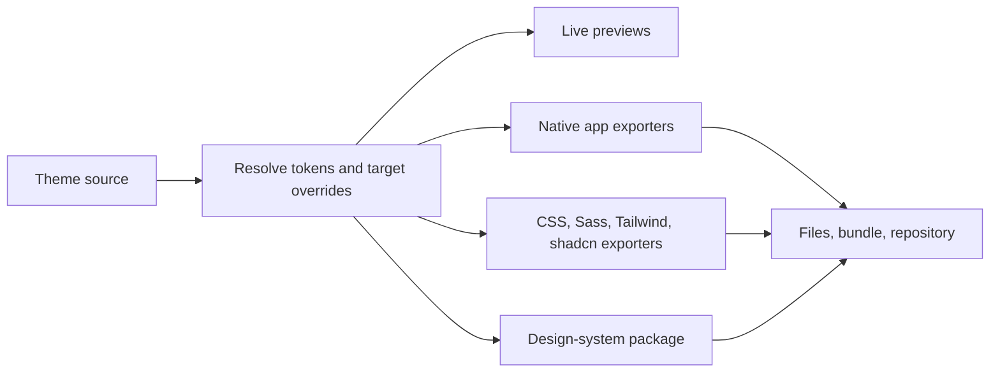

# ThemeSpace product direction

Product direction, 6 September 2026. A working first version now lives in `web/`.
The sections below preserve the broader product design; proposed package paths
and future capabilities are not all implemented. See the root README for the
current support matrix and limitations.

## Product promise

Create one visual identity and use it across your software. Start from a preset
or another creator's theme, customize it with immediate previews, and export
installable themes for the apps you use. Publish a version for others to
discover and remix.

The scope includes both installable app themes and a reusable design-system
package for building new websites and apps. CSS, Sass/SCSS, Tailwind CSS, and
shadcn/ui are required export targets. This makes a theme useful both for
personalizing existing software and for creating new software with the same
visual identity.

Comfy becomes a preset. The generator must also support other palettes, light
appearances, typography, and styling choices without inheriting Comfy-specific
names or assumptions.

## What the references establish

**Comfy already demonstrates the underlying model.** Its root README separates
shared backgrounds, accents, text, semantics, borders, and styling rules from
application overrides. The design-system package adds CSS tokens, typography,
component previews, and a terminal/editor kit. Ghostty and the local T3 Code
port show concrete translations into different native formats. The
`comfy-theme` skill contributes a repeatable workflow: inspect the application,
map roles, package the result, validate it, and document installation.

Research covered the local collection and its live remote. At inspection, the
local checkout was at `326ae83546195b007e7008501924df27609216e0`; remote `main`
was at `936c56bd3177fa33b69c59607db9c94eef174016`. The remote included SmartGit
and GitComet ports; the local working tree included T3 Code and skill additions.
These are reference material, not a claim that ThemeSpace supports those apps.

**Open Design provides a portable package pattern.** Its current upstream
documentation specifies a manifest, `DESIGN.md`, and `tokens.css`, with optional
component fixtures, previews, assets, and derived exports. ThemeSpace should
borrow that separation between machine-readable values, human-readable design
decisions, and examples. The older nine-section-only guidance in the local
checkout differs from current upstream; any compatibility export should target
a tested package version. [Open Design package documentation](https://github.com/nexu-io/open-design/blob/main/design-systems/README.md).

**Claude Design provides an authoring pattern.** It builds reusable palettes,
typography, components, and layout patterns from supplied references, then lets
the owner review that system. ThemeSpace can use the same visible foundations
and review flow. Importing references and suggesting a palette can come later;
manual configuration should work immediately. [Claude Design setup guide](https://support.claude.com/en/articles/14604397-set-up-your-design-system-in-claude-design).

## Main experience

### Studio

The primary workspace is the theme editor. A new visitor can try it without an
account, beginning with Comfy or a small set of clearly attributed presets.

- **Left:** palette, typography, shape, and motion controls. Begin with a few
  useful controls: background, accent, text, warmth, and contrast. Advanced
  editing exposes individual semantic, syntax, and terminal colors.
- **Center:** simultaneous terminal, editor, and web component previews, with a
  larger single-target view available. Web previews include a real shadcn/ui
  component collection and representative dashboard. Editing a token updates
  every relevant preview immediately. Examples include hover, selection,
  keyboard focus, errors, warning messages, diffs, and terminal output.
- **Right:** details for the selected integration, including supported settings,
  overrides, and readability feedback for actual foreground/background pairs.
- **Top:** theme name, appearance, undo/redo, saved state, and export.

Use the selected colors to suggest related surfaces and interaction states.
Let users lock a value, override a suggestion, and reset an app to shared
defaults. App-specific overrides remain explicit when the shared palette
changes. Light and dark variants are independently editable; a missing variant
is not silently fabricated by inverting colors.

The editor defaults to its own ThemeSpace appearance. Settings can apply a
starter palette, a fixed custom snapshot, or the live Draft across the site.
Draft follows Studio edits immediately; the site's independent light/dark/system
setting selects the appearance. Preferences persist in browser local storage
without an account and can be backed up or reset.

Web component previews can render the actual exported CSS. Native-app previews
need clear scope: a representative mockup helps compare colors but does not
prove that a native theme loads correctly.

### Explore and theme pages

Explore displays themes with consistent preview scenes so visitors can compare
them. Cards show the theme name, creator, appearance, and supported integrations.
Filter by app or framework, light/dark appearance, color family, and tags.

A theme page contains app previews, its design-system preview, installation
options, license, version, and remix attribution. Its primary actions are
**Use this theme**, **Remix**, and **Download**. Remix creates a new draft with
the original theme and version recorded.

Published themes require shared persistent storage. Browser-local drafts and a
curated preset grid are useful during development, but are not a community
catalog. Publishing creates a versioned snapshot; subsequent edits stay in a
draft until the creator publishes an update. Public discovery is an explicit
choice, separate from exporting or keeping a personal draft.

### Export

Offer three destinations from the same theme revision:

1. **One integration:** select an app or framework and download its file or
   package with concise
   installation instructions and the tested compatibility information.
2. **Complete bundle:** download all selected app themes, framework outputs,
   and the design system.
3. **Repository scaffold:** download sources, generated files, documentation,
   and a pinned regeneration toolchain. A later GitHub integration can create
   the repository in the user's chosen account.

Default to one repository per theme family, with app subdirectories. That keeps
the shared source and all outputs together. Separate repositories per app can
be an advanced distribution option once there is demand for them.

## Web framework exports

Treat each ecosystem as an export target with its own integration instructions,
version profile, and working example. Users select the one their project uses;
all exports are generated from the same theme source.

| Target | Generated output | Intended integration |
| --- | --- | --- |
| CSS | Namespaced custom properties, appearance overrides, and optional component styles | Import into plain HTML, CSS Modules, or applications built with React, Vue, Svelte, Astro, and other web frameworks. |
| Sass / SCSS | Typed variables, appearance maps, and an entry module using `@use` / `@forward` | Compile with Dart Sass; offer a mixin that emits the corresponding CSS variables when runtime switching is needed. |
| Tailwind CSS v4 | A CSS theme entry with utility mappings using `@theme` / `@theme inline` | Map colors, type, radii, spacing, shadows, and motion into the appropriate Tailwind namespaces. |
| shadcn/ui | Theme variables, paired foregrounds, and matching Tailwind mappings | Style the consumer's existing shadcn/ui components, with working light/dark examples for the exported appearances. |
| Design tokens | A versioned token interchange file | Allow other tools to consume the values without depending on a particular UI framework. |

Tailwind v4 supports mapping existing CSS variables to utilities through
`@theme inline`. This allows runtime appearance changes to use the same
semantic utilities. Any future Tailwind v3 preset must be a separately tested
profile, since its configuration format differs. [Tailwind theme documentation](https://tailwindcss.com/docs/theme).

Sass variables are resolved at compilation; CSS custom properties remain in
the stylesheet. The Sass export therefore needs both literal values for Sass
consumers and an optional CSS-variable emitter for runtime appearances.
Document the two uses clearly. [Sass variables](https://sass-lang.com/documentation/variables/),
[Sass modules](https://sass-lang.com/documentation/at-rules/use/).

Sass and Tailwind exports are independent build entries. Tailwind v4's own
documentation says it is not designed to run through Sass; supporting both
means producing an appropriate artifact for each pipeline. [Tailwind compatibility](https://tailwindcss.com/docs/compatibility).

The shadcn/ui adapter needs deliberate semantic mapping. Cover background,
card, popover, primary, secondary, muted, accent, destructive, border, input,
focus ring, charts, sidebar, radii, and their applicable foreground roles.
For example, a theme's brand accent can map to shadcn's `primary`, while a
subtle interaction highlight can map to `accent`. Matching names alone does
not establish matching roles. [shadcn/ui theming](https://ui.shadcn.com/docs/theming).

Keep fonts, typography scales, radii, spacing, shadows, and motion in the core
model so web exports express more than colors. Represent chart-series colors
separately from semantic statuses and terminal colors. Each profile controls
how far these choices apply to the consumer's existing components.

Importing theme variables should not replace the consumer's components or
reset styles. Offer any baseline component styles as an explicit extra.
The export screen shows the target, tested version, import snippet, and files.

The initial shadcn preview should use actual pinned components: buttons,
inputs, cards, dialogs, menus, tables, a sidebar, and a chart. Compile separate
CSS, Sass, and Tailwind consumer fixtures and verify the resulting colors and
states. This demonstrates compatibility beyond showing generated text.

## Generation model



The source document holds identity, appearances, palette values, semantic
assignments, style choices, target overrides, and attribution. Give the schema a
version so saved themes can migrate as the product evolves.

Keep these token groups distinct:

- Surfaces, text, borders, focus, hover, selection, and accent foregrounds.
- Success, warning, error, information, additions, modifications, and deletions.
- Editor syntax and the terminal ANSI palette, which need independent tuning.
- Categorical chart and graph palettes, with series that remain distinguishable.
- Typography, spacing, radii, elevation, and motion for targets that support them.

Each exporter declares its supported roles, file format, compatibility
range, installation method, and validator. The mapping resolves theme values
into literal values where required, including alpha blending for opaque-only
targets. Unsupported styling controls should be identified per app.

For example, changing an accent can update terminal blue, editor focus, and a
web button, while the web button's text uses its paired foreground token.
Making these separate roles prevents a palette edit from assuming that one
foreground works on every background.

Generation should be deterministic: the same theme source and exporter
versions produce the same files. AI can suggest palettes, interpret references,
or help maintain exporters. Routine slider changes and downloads go through
tested mappings. Generated files and previews share the same resolved values.

## Proposed repository export

```text
my-theme/
  theme.json                    # editable canonical source
  theme.lock.json               # schema/generator/exporter versions
  package.json                  # pinned regeneration command
  <package-manager lockfile>
  README.md                     # overview, app index, regeneration instructions
  LICENSE                       # creator's chosen distribution terms
  THIRD_PARTY_NOTICES.md         # applicable source/template attribution
  design-system/
    manifest.json
    DESIGN.md                   # generated design guidance
    tokens.css
    tokens.json                 # interoperable token export
    components.html
    preview/
  integrations/
    css/
      theme.css
      README.md
    scss/
      _index.scss
      _tokens.scss
      README.md
    tailwind-v4/
      theme.css
      README.md
    shadcn/
      theme.css
      README.md
  apps/
    ghostty/
      README.md
      themes/My Theme
    vscode/
      README.md
      package.json
      themes/my-theme-color-theme.json
    zed/
      README.md
      themes/my-theme.json
```

The source remains editable after export. Regeneration updates documented
generated paths while preserving unrelated repository content. Pin the
generator, dependencies, and selected exporter versions so the repository can
reproduce downloads without access to the creator's ThemeSpace account.

Generate framework integrations, documentation, component previews, and native
files from the same source. Use a dedicated export for Open Design's package
contract, and test its
import before advertising compatibility. Likewise, implement and validate a
token interchange export against the [Design Tokens Format Module](https://www.designtokens.org/tr/2025.10/format/)
before describing it as compliant.

The skill's generalization is also useful later: a generated theme package can
carry guidance that helps an agent apply the user's theme to another app.
The agent should read the exported source and mapping rules, retaining the
skill's host-format validation workflow.

## First release and expansion

Build the first release around the required web integrations, a few native app
exporters, and a strong Studio. These are proposed targets; each needs
implementation and validation in its intended consumer.

| Target | First-release role | Evidence and work required |
| --- | --- | --- |
| Ghostty | Terminal theme export | Existing Comfy file and [official theme format](https://ghostty.org/docs/features/theme); validate generated palettes in Ghostty. |
| VS Code | Workbench, syntax, and terminal theme | [Official color-theme guide](https://code.visualstudio.com/api/extension-guides/color-theme); implement mappings and extension packaging, then load the result. |
| Zed | A second editor export | [Official theme guide](https://zed.dev/docs/themes); implement and validate a native JSON theme. |
| CSS | Custom properties and appearance switching | Verify plain CSS consumers and scoped component previews. |
| Sass / SCSS | Variables, maps, and CSS-variable emitter | Compile real consumers with Dart Sass and compare emitted values. |
| Tailwind CSS v4 | Theme CSS and utility mappings | Compile a consumer and verify generated utilities, including appearance switching. |
| shadcn/ui | Complete semantic theme profile | Apply the export to pinned components and verify menus, dialogs, sidebar, charts, and interaction states. |
| Reusable design system | Tokens, design guidance, components, and preview pages | Generalize Comfy's package and verify that examples consume the generated tokens. |

T3 Code, GitComet, and SmartGit are natural follow-ups because the collection
already supplies reference ports. Confirm the actual target release's theme
interface before treating any port as broadly compatible. Discord and Spotify
through Spicetify fit the longer-term catalog; show the required client or
customization tool and test that route. Spicetify documents its theme files in
its [theme guide](https://spicetify.app/docs/customization/themes).

For websites generally, each target still needs a supported theme API, an
extension, or a maintained user-style integration. Track the installation
method on the app card; broad website support requires real integrations.

Suggested implementation sequence:

1. Theme schema, Comfy preset, resolved tokens, and CSS, Tailwind, and shadcn/ui
   integration previews. Establish the shared model around real web consumers.
2. Studio with autosaved drafts, undo/redo, import/export, Sass support, the
   reusable design-system package, and one complete Ghostty export.
3. VS Code and Zed exporters, individual integration downloads, complete ZIP,
   and a reproducible repository scaffold.
4. Accounts for saved work across devices, versioned publication, shared
   Explore, theme detail pages, and attributed remixing.

Image/URL extraction, prompt-based editing, automatic light-variant proposals,
GitHub repository creation, and a public CLI can follow this first release.
The first editor should already be useful without those additions.

## Acceptance criteria

- A user can edit a preset, reload without losing a draft, undo changes, and
  import the exported source into a fresh session.
- All relevant previews and downloaded outputs reflect the same revision.
- Each advertised exporter passes its format/schema checks and a real host
  load or installation check for the documented version. JSON parsing alone
  does not establish compatibility.
- CSS, Sass, Tailwind, and shadcn/ui outputs pass real consumer build/render
  checks. Switching appearances updates components and matching foregrounds;
  font, shape, and other supported tokens apply consistently.
- Readability feedback evaluates actual color pairs and appearance variants;
  the app does not claim whole-theme accessibility from one passing ratio.
- A downloaded repository can regenerate its app files with its pinned tools.
- Explore and remix work across independent accounts/sessions, and a published
  version remains stable while its creator edits a draft.

## Current state

The first implementation includes a theme Studio, persistent signed-in drafts,
Explore with real immutable publications and remixing, 26 exporters, reusable
design-system files, and independently regenerable repository downloads. The
catalog also exposes 13 planned integrations without download controls.

Web compilation, native file parsing, Zed schema validation, repository rebuilds,
ZIP round-trips, and API persistence/authentication checks are covered. Native
application loading and browser interaction testing have not been performed.
There is no hosted public community deployment yet. Open Design importer
compatibility is not certified. Reference repositories remain unchanged.
